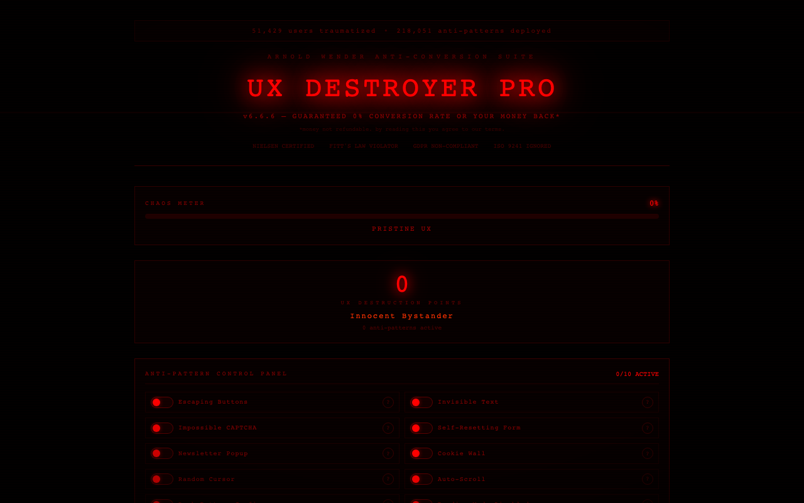

# :skull: UX Destroyer Pro

**Toggle 10 anti-UX patterns live on the page — experience the worst of web design.**

Built by [Arnold Wender](https://arnoldwender.com)

[:rocket: Live Demo](https://ux-destroyer-pro.netlify.app)



## Features

- 10 toggleable anti-UX patterns — enable them one by one or all at once
- Boss Mode with survival timer — how long can you endure maximum chaos?
- Chaos meter that tracks your current level of UX destruction
- Live UX score that drops as you enable more anti-patterns
- Rickroll easter egg hidden somewhere in the interface
- Premium trap — a fake upgrade flow that leads nowhere
- Dark pattern showcase including fake close buttons, moving CTAs, and more
- Confetti celebrations for surviving the worst UX imaginable

## Anti-Patterns Include

- Cursor hijacking
- Random element repositioning
- Aggressive popup storms
- Fake loading screens
- Impossible-to-close modals
- Comic Sans everywhere
- Autoplaying sounds
- Seizure-inducing animations
- GDPR cookie wall from hell
- The mystery meat navigation

## Tech Stack

- **React 18** + **TypeScript**
- **Vite** — lightning-fast dev server and builds
- **Tailwind CSS** — utility-first styling
- **Framer Motion** — chaotic animations and transitions
- **canvas-confetti** — celebration effects
- **html2canvas** — chaos screenshot export
- **Lucide React** — icon set

## Getting Started

```bash
# Clone the repository
git clone https://github.com/arnoldwender/ux-destroyer-pro.git
cd ux-destroyer-pro

# Install dependencies
npm install

# Start development server
npm run dev
```

Open [http://localhost:5173](http://localhost:5173) in your browser.

## Build

```bash
npm run build
npm run preview
```

## License

MIT
